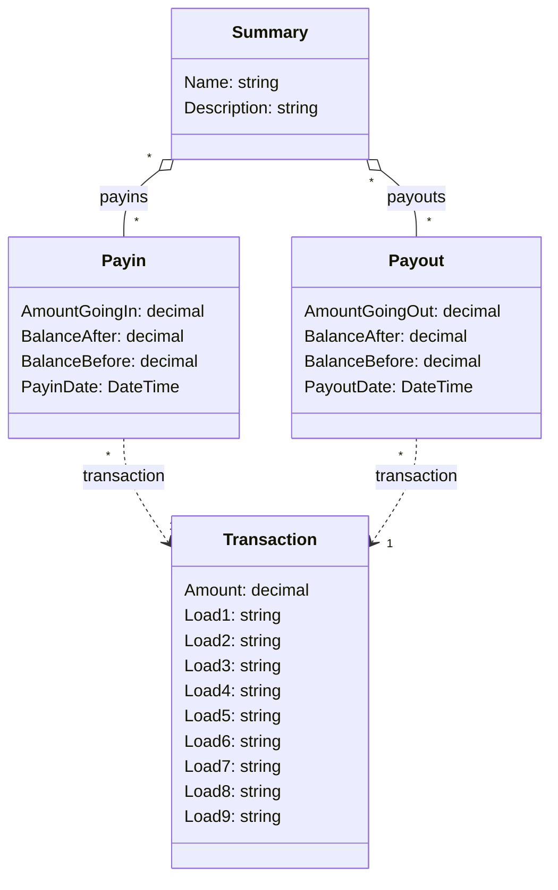

# Benchmarking EFCore 3.1 Cartesian explosion problem
In Entity Framework Core 3.1 any LinQ expression is translated into a single SQL statement. This will not be a problem for most queries, but it can cause performance problems if developers are not cautious of this when crafting queries. This article will introduce a modified model of a performance problem that was discovered and solved in a production environment.

The problem was fixed in EF Core 5 with [split queries](https://docs.microsoft.com/en-us/ef/core/what-is-new/ef-core-5.0/whatsnew#split-queries)!
## The domain
The problem happened in an economic system that handles payments for a goverment department to different municipalities. The system records payments in and out of the system. Payments going into the system will be recorded as `Payin` and payments going out of the system will be recorded as `Payout`. These payments will be represented in a specific bank `Transaction`. The transaction in the bank does not care about what is being payed in and out of the system, but is a simple aggregate. For example if 100 goes in and 20 goes out a `Payin` of 100 and a `Payout` of 20 will be recorded. However, these might be aggregated in the `Transaction`, which specifies that 80 goes into the system. All these belong into a larger system and they have other usecases, so simplifing the model is not a possiblity. The last entry needed is the `Summary`, which acts as a way to record `Payin`s and `Payout`s for some specific requirements. The `Summary` will therefore contain a list of both `Payin`s and `Payout`s, each of which will have a connected `Transaction`. The domain model snippet is the following:


## The problem
A major part of the system needs to aggregate all `Transaction`s that are connected to a specific `Summary` through the `Payin` and `Payout`s. The code to do this would simply take the `Summary` into memory with all `Payin` and `Payout`s included with their respective `Transaction`s. It will then select all the `Transaction`s. The code looks like the following:
```
var all = await db
	.Set<Summary>()
	.Include(x => x.payouts)
		.ThenInclude(x => x.Transaction)
	.Include(x => x.payins)
		.ThenInclude(x => x.Transaction)
	.SingleAsync(x => x.SummaryId == summaryId);

var transactions = new List<Transaction>();

var payoutTransactions = all.payouts
	.Where(x => x.Transaction != null)
	.Select(x => x.Transaction!)
	.ToList();

var payinTransactions = all.payins
	.Where(x => x.Transaction != null)
	.Select(x => x.Transaction!)
	.ToList();

transactions.AddRange(payoutTransactions);
transactions.AddRange(payinTransactions);

return transactions
	.Distinct()
	.ToList();
```

Lets break down the code into understandable pieces. The first part sets the *all* variable by specifying it should take the `Summary` table and *Include* `Payin`s and *ThenInclude* its `Transaction`s, and *Include* `Payin`s and *ThenInclude* its `Transaction`s. The *SingleAsync* is responsible for transforming the entire LinQ statement into an SQL statement, executing it and loading the classes that into memory. The remaining code simply selects all the `Transaction`s and adds them to a combined list taking only the *Distinct* `Transaction`s.

The SQL that will be generated to get everything into memory is the following statement (slightly modified to not show selected fields):
```
SELECT t.*, t1.*, t3.*
FROM (
	SELECT s.*
	FROM "Summaries" AS s
	WHERE s."SummaryId" = 1
	LIMIT 2
) AS t
LEFT JOIN (
	SELECT p.*, t0.*
	FROM "Payouts" AS p
	LEFT JOIN "Transactions" AS t0 ON p."TransactionId" = t0."TransactionId"
) AS t1 ON t."SummaryId" = t1."SummaryId"
LEFT JOIN (
	SELECT p0.*, t2.*
	FROM "Payins" AS p0
	LEFT JOIN "Transactions" AS t2 ON p0."TransactionId" = t2."TransactionId"
) AS t3 ON t."SummaryId" = t3."SummaryId"
ORDER BY t."SummaryId", t1."PayoutId", t3."PayinId"
```
The problems with this statement is the multiple joins in a row. The way sql joins works is by effectively taking every rows previously selected and combining them with every row returned by the join. For example in case a 5 `Payin`s and 5 `Payout`s exists for the specific `Summary`. It will start by selecting the the single row for the `Summary` then it will join the 5 rows for `Payin` for a total of 5 rows. It will then combine each of those 5 rows with the 5 rows for `Payout`. This will give a total of 25 rows returned. All this data will be returned in a raw format and EF Core will then ignore the repeated data when turning everything into objects. This is a clear exponential problem and is the essense of the Cartesian Explosion.

## Investigated solutions
Two different solutions should will be investigated to solve this. The first still takes everything into memory, but will do so in two different queries. The second will use LinQ to only take the needed `Transaction`s from the database.

### Splitting into two different queries
The following text will refer to this as the `HalfOut` way. It works by splitting the query that takes the `Payin`s and `Payout`s into two separate queries. The code looks the following way:

```
var allIn = await db
	.Set<Summary>()
	.Include(x => x.payins)
		.ThenInclude(x => x.Transaction)
	.SingleAsync(x => x.SummaryId == summaryId);

var allOut = await db
	.Set<Summary>()
	.Include(x => x.payouts)
		.ThenInclude(x => x.Transaction)
	.SingleAsync(x => x.SummaryId == summaryId);

var transactions = new List<Transaction>();

var payoutTransactions = allOut.payouts
	.Where(x => x.Transaction != null)
	.Select(x => x.Transaction!)
	.ToList();

var payinTransactions = allIn.payins
	.Where(x => x.Transaction != null)
	.Select(x => x.Transaction!)
	.ToList();

transactions.AddRange(payoutTransactions);
transactions.AddRange(payinTransactions);

return transactions
	.Distinct()
	.ToList();
```

It will generate two different SQL statements, since it contains two *SingleAsync*:
```
SELECT t.*, t1.*
FROM (
	SELECT s."SummaryId", s."Description", s."Name"
	FROM "Summaries" AS s
	WHERE s."SummaryId" = 1
	LIMIT 2
) AS t
LEFT JOIN (
	SELECT p.*, t0.*
	FROM "Payins" AS p
	LEFT JOIN "Transactions" AS t0 ON p."TransactionId" = t0."TransactionId"
) AS t1 ON t."SummaryId" = t1."SummaryId"
ORDER BY t."SummaryId", t1."PayinId"
```
and
```
SELECT t.*, t1.*
FROM (
	SELECT s."SummaryId", s."Description", s."Name"
	FROM "Summaries" AS s
	WHERE s."SummaryId" = 1
	LIMIT 2
) AS t
LEFT JOIN (
	SELECT p.*, t0.*
	FROM "Payouts" AS p
	LEFT JOIN "Transactions" AS t0 ON p."TransactionId" = t0."TransactionId"
) AS t1 ON t."SummaryId" = t1."SummaryId"
ORDER BY t."SummaryId", t1."PayoutId"
```
The effect of these two SQL statements is that instead of generating a total of 25 rows in a single statement. The two statements will each return a total of 5 rows for a total of 10 rows, which are all the rows needed.

### Only taking out the parts needed
The following text will refer to this as the `SmartOut` way. The smart solution here is that, since only the `Transaction`s are needed, it will only select the `Transaction`s from the database. The code is the following:
```
var allIn = db
	.Set<Summary>()
	.Include(x => x.payins)
		.ThenInclude(x => x.Transaction)
	.Where(x => x.SummaryId == summaryId)
	.SelectMany(x => x.payins)
	.Select(x => x.Transaction);

var allOut = db
	.Set<Summary>()
	.Include(x => x.payins)
		.ThenInclude(x => x.Transaction)
	.Where(x => x.SummaryId == summaryId)
	.SelectMany(x => x.payins)
	.Select(x => x.Transaction);

return await allIn
	.Concat(allOut)
	.Distinct()
	.ToListAsync();
```

The code will start by selecting the transactions from the `Payin`s and `Payout`s. However, nothing will have been translated into actual SQL statements, since no method for querying has been called. It will then concatenate the two queries and call *Distinct*. Still nothing will have been converted to SQL. The SQL will then be generated only at the last moment when `ToListAsync` is called.

The SQL generated from this code is the following:

```
SELECT DISTINCT t1.*
FROM (
	SELECT t.*
	FROM "Summaries" AS s
	INNER JOIN "Payins" AS p ON s."SummaryId" = p."SummaryId"
	LEFT JOIN "Transactions" AS t ON p."TransactionId" = t."TransactionId"
	WHERE s."SummaryId" = 1
	UNION ALL
	SELECT t0.*
	FROM "Summaries" AS s0
	INNER JOIN "Payins" AS p0 ON s0."SummaryId" = p0."SummaryId"
	LEFT JOIN "Transactions" AS t0 ON p0."TransactionId" = t0."TransactionId"
	WHERE s0."SummaryId" = 1
) AS t1
```
This SQL will only return the `Transaction`s, which means that if only 10 `Transaction`s exists, only 10 `Transaction`s will be send from the database, even if more then a 1000 `Payin` and/or `Payout`s are in the `Summary`.

## Benchmarking and results
In order to test the hypothesis presented a benchmark was created to verify the assumptions. The testdata generated are 500 `Payin`s and 500 `Payout`s connected to a single `Summary`. Each of those will be connected to one of 5 different `Transaction`s.

The benchmarking was done with [BenchmarkDotNet](https://benchmarkdotnet.org/articles/overview.html), which uses a statistical approach for executing until a solid execution time has been established.

The results are as follows:
|   Method |         Mean |      Error |     StdDev |       Median |
|--------- |-------------:|-----------:|-----------:|-------------:|
|   AllOut | 1,632.619 ms | 15.7387 ms | 14.7220 ms | 1,629.781 ms |
|  HalfOut |    11.283 ms |  1.1011 ms |  3.1593 ms |    12.914 ms |
| SmartOut |     1.885 ms |  0.0125 ms |  0.0117 ms |     1.890 ms |

The initial problem method (`AllOut`) took around 1.6 seconds to execute. The `HalfOut` method took around 11-12 milliseconds to execute. Two orders of magnitude faster with only a total of 1000 `Payin`/`Payout`s. Finally, the `SmartOut` method took 1.8 milliseconds, which is almost an order of magnitude faster then the `HalfOut` method.

## Conclusion

The inclusion of multiple list in a single EF Core 3.1 query is an incredible bad idea, because it will cause an exponential explosion in the amount of rows returned. This can be fixed by ensuring that only a single list is included per query. However, usually a more efficient approach is to rethink what should leave the database and pick only the specific entities needed.